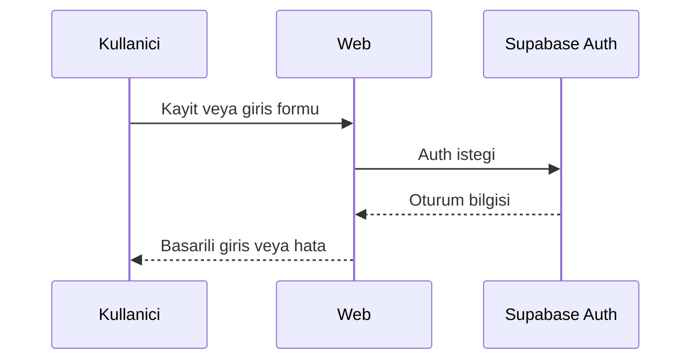
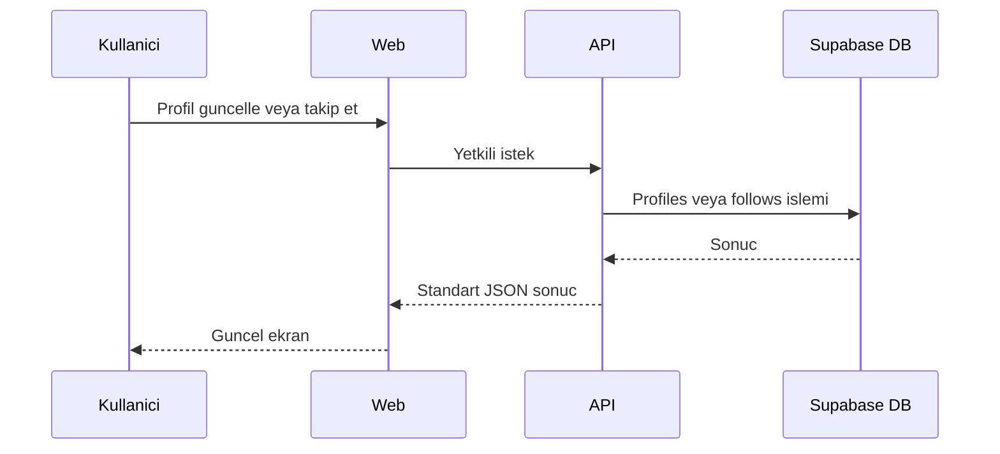
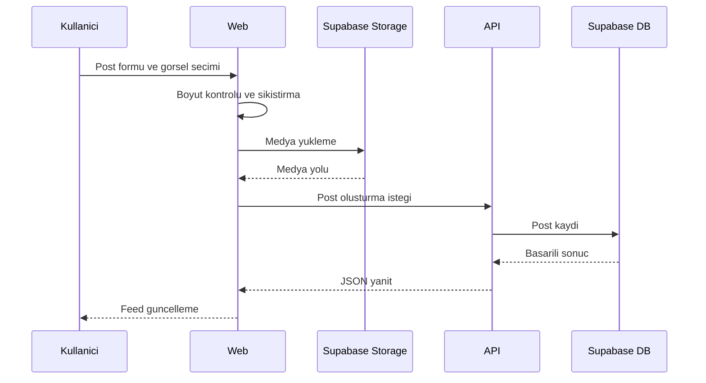
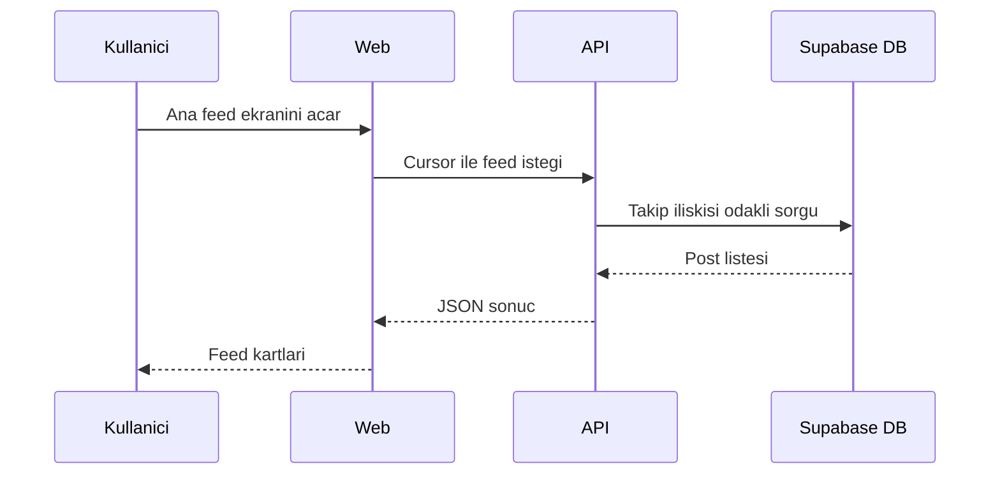
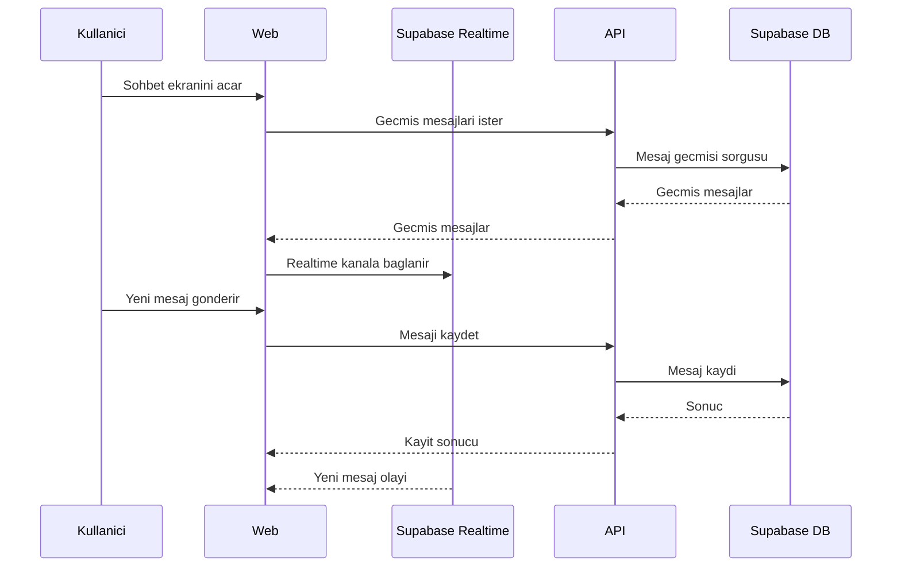

# Veri Akislari ve Entegrasyonlar

## Amac
Bu belge, kritik kullanici akislarinda verinin hangi bilesenler arasindan gececegini netlestirir.

## Auth Akisi


Kararlar:
- Kimlik bilgisi Supabase Auth tarafinda kalir.
- Web yalnizca gerekli oturum bilgisini kullanir.
- Korunan API uclari token dogrulamasi ile calisir.

## Profil ve Takip Akisi


Kararlar:
- Profil verisi `public.profiles` tarafinda tutulur.
- Takip iliskileri `follows` tablosunda tutulur.
- Takip sayaçlari icin gereksiz karmasiklik eklenmez; sade ve tutarli cozum hedeflenir.

## Post Olusturma ve Medya Akisi


Kararlar:
- Gorsel yukleme once istemci tarafinda sinirlandirilir.
- Post kaydi ile medya yolu birlikte ele alinir.
- Yarım basari hissi olusmaması hedeflenir.

## Feed Akisi


Kararlar:
- Feed yalnizca takip edilen hesaplara gore uretilir.
- Cursor pagination zorunludur.
- Feed karti basit ve tekrar kullanilabilir kalir.

## DM Akisi


Kararlar:
- Gecmis mesaj API ile, anlik mesaj Realtime ile desteklenir.
- Supabase Realtime ilk surumde yeterli kabul edilir.
- Socket.IO ilk surumde devreye alinmaz.

## Hata Yaniti Sozlesmesi
Tum API hatalari tek tip JSON modelini kullanir:

```json
{
  "success": false,
  "error": {
    "code": "VALIDATION_ERROR",
    "message": "Gecerli bir istek gonderin.",
    "requestId": "..."
  }
}
```

Bu model, istemci tarafinda sade ve tek tip hata gostermeyi kolaylastirir.