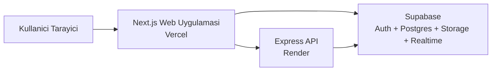

# Sistem Topolojisi

## Amac
Bu belge, DevConnect sisteminin bilesenlerini ve bilesenler arasi sinirlari tek bakista anlatir.

## Tek Sayfalik Sistem Ozeti
- Kullanici tarayicidan Next.js web uygulamasina erisir.
- Web uygulamasi, ihtiyaca gore Express API ve Supabase servisleri ile konusur.
- Auth, veritabani, storage ve realtime altyapisi Supabase tarafinda kalir.
- Express API, is kurali, dogrulama ve korunan backend akislari icin kullanilir.
- Canliya alma topolojisinde web ve API ayri dagitilir.

## Bilesen Topolojisi

## Sorumluluk Sinirlari

### Next.js Web
- Sayfa kabugu, route yapisi ve UI akislarini tasir.
- Server destekli ilk yukleme ve auth kontrolu yapabilir.
- Etkilesimli ekranlarda client tarafli veri cekme kullanir.
- Karmaşik is kurallarini barindirma yeri degildir.

### Express API
- Korunan endpoint'leri, validation, hata yonetimi ve is kurallarini tasir.
- Supabase ile kontrollu servis erisimi saglar.
- Secret gerektiren veya istemciye acilmamasi gereken islemleri izole eder.
- Uzun omurlu Node servis gerektiren alanlari tasir.

### Supabase
- Kimlik dogrulama ve oturum altyapisini saglar.
- PostgreSQL veritabani uzerinden iliskisel veriyi tutar.
- Storage ile avatar ve post medyasini tutar.
- Realtime ile DM ve secili anlik olaylari saglar.

## Deployment Topolojisi
- Web: Vercel
- API: Render
- Veri ve servis katmani: Supabase

Bu ayrim su nedenle secilmistir:
- Next.js Vercel ile dogal uyumludur.
- Klasik Express servis omru Render uzerinde daha duz ve ongorulebilir kalir.
- Supabase, ilk surum icin ihtiyac duyulan veri servislerini tek yerde toplar.

## Sistem Disi Tutulan Alanlar
- Ayrica yonetilen Redis katmani yoktur.
- Ayrica yonetilen MongoDB katmani yoktur.
- Ayrica yonetilen mesaj broker katmani yoktur.

## Sunum Icin Onerilen Diyagramlar
- Sistem bilesen topolojisi
- Auth veri akisi
- Post olusturma veri akisi
- DM veri akisi
- Monorepo klasor haritasi

## Faz 2'ye Girdi Notu
Bu topolojiye gore repo yapisi ve environment modeli kurulacaktir.