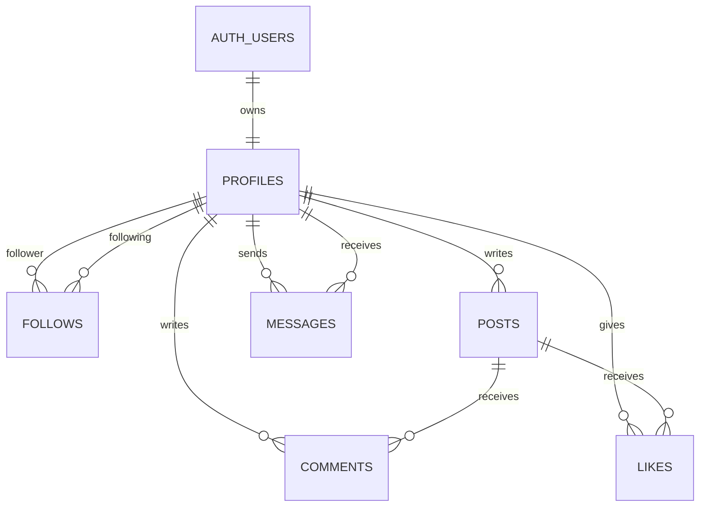

# Kurulum, Environment, API ve Schema Ozeti

## Hizli Kurulum
1. Koku dizinde `npm install` calistir.
2. `apps/api/.env.example` ve `apps/web/.env.example` dosyalarindan yerel `.env.local` degerlerini olustur.
3. `npm run dev` ile web ve API'yi birlikte baslat.
4. Temel kalite kontrolu icin `npm run check` calistir.
5. Faz 12 tam test zinciri icin `npm run test:phase12` kullan.

## Production Environment Ozeti

### Web
- `NEXT_PUBLIC_SUPABASE_URL`: Public Supabase URL
- `NEXT_PUBLIC_SUPABASE_ANON_KEY`: Public anon key
- `NEXT_PUBLIC_API_BASE_URL`: API taban URL

Referans dosya: `apps/web/.env.production.example`

### API
- `PORT`: API portu
- `WEB_ORIGIN`: Virgulle ayrilan izinli web origin listesi
- `SUPABASE_URL`: Supabase URL
- `SUPABASE_ANON_KEY`: Public anon key
- `SUPABASE_SERVICE_ROLE_KEY`: Sadece server secret
- `SUPABASE_PROJECT_REF`: Proje ref'i
- `SUPABASE_REGION`: Bolge
- `COOKIE_SECURE`: Production icin `true`

Referans dosya: `apps/api/.env.production.example`

## API Uclari Ozeti

### Health
- `GET /health`: Public servis saglik kontrolu
- `GET /ready`: Public hazirlik kontrolu

### Auth
- `POST /auth/register`: Kayit
- `POST /auth/login`: Giris
- `POST /auth/logout`: Cikis
- `GET /api/session`: Aktif oturum bilgisi, auth gerekli

### Viewer
- `GET /api/me`: Giris yapmis kullanicinin kisa profil ozeti

### Profiles
- `GET /api/profiles/me`: Kendi profili
- `PATCH /api/profiles/me`: Profil guncelleme
- `POST /api/profiles/me/avatar`: Avatar yukleme
- `GET /api/profiles/:profileId`: Profil detay
- `POST /api/profiles/:profileId/follow`: Takip et
- `DELETE /api/profiles/:profileId/follow`: Takibi birak

### Posts
- `GET /api/profiles/:profileId/posts`: Profile gore post listesi
- `POST /api/posts`: Post olusturma
- `DELETE /api/posts/:postId`: Kendi postunu silme

### Feed
- `GET /api/feed`: Takip tabanli feed sayfasi, cursor destekli

### Messages
- `GET /api/messages/realtime-auth`: Realtime icin memory-yalin auth token yuzeyi
- `GET /api/messages`: Konusma listesi
- `GET /api/messages/conversations/:partnerId`: Konusma gecmisi
- `POST /api/messages`: Yeni mesaj gonderme
- `POST /api/messages/conversations/:partnerId/read`: Okundu guncelleme

## Veri Modeli Ozeti

### Ana Tablolar
- `public.profiles`: Kullanici kimligi, bio, avatar ve skill bilgileri
- `public.follows`: Sosyal grafik iliskileri
- `public.posts`: Text, code ve image odakli postlar
- `public.likes`: Tekrarsiz begeni kayitlari
- `public.comments`: Post yorumlari
- `public.messages`: Birebir mesaj gecmisi

## Sunumda Soylenecek Kisa Teknik Nokta
Like ve comment tablolari schema seviyesinde hazir olsa da, bu workspace'te bunlari kullanan isleyen modul ve UI teslim kapsaminda degildir. Bu nokta gizlenmemeli, olgunlasmamis backlog maddesi olarak anlatilmalidir.